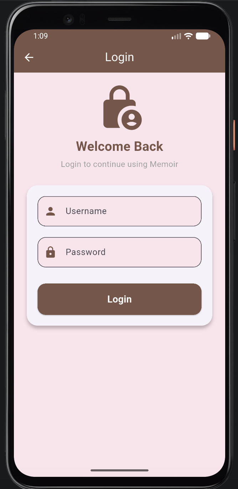
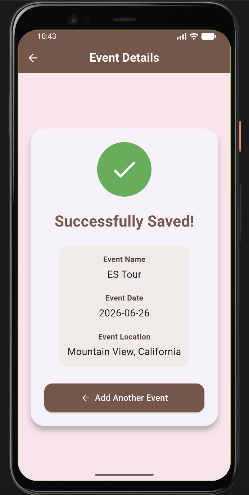

# Memoir – Mobile Event Reminder Application

Memoir is a mobile event reminder application developed using Flutter and Dart. The application allows users to create, manage, and organize personal events such as appointments, meetings, exams, and daily activities.

## Features

* User registration and login
* Create, view, edit, and delete events
* Store events locally using SharedPreferences
* Display events based on the selected date
* Sort and organize upcoming events
* Add event locations
* Retrieve weather information based on the event location
* Attach images from the device gallery
* Mark events as favourites
* Delete and edit existing events
* Submit and view application reviews

## Technologies Used

* **Flutter** – Mobile application development
* **Dart** – Programming language
* **SharedPreferences** – Local data storage
* **OpenWeather API** – Weather information
* **Google Apps Script** – Backend integration for reviews
* **Google Sheets** – Review data storage
* **GPS / Location Services** – Current location functionality

## Application Screens

*Add screenshots of the application here.*

Example:






## Project Structure

```text
lib/
├── main.dart
├── models/
├── pages/
├── services/
└── widgets/

assets/
└── ...
```

## Getting Started

### 1. Clone the repository

```bash
git clone https://github.com/ameerahasban-oop/memoir-event-reminder.git
```

### 2. Open the project

```bash
cd memoir-event-reminder
```

### 3. Install dependencies

```bash
flutter pub get
```

### 4. Configure the OpenWeather API

The weather feature requires an OpenWeather API key.

Open:

```text
lib/weather_service.dart
```

Replace:

```dart
static const String apiKey =
    "YOUR_OPENWEATHER_API_KEY";
```

with your own OpenWeather API key.

**Note:** The actual API key is not included in this repository for security reasons.

### 5. Run the application

Connect an Android device or start an Android emulator, then run:

```bash
flutter run
```

## Learning Outcomes

Through this project, I gained practical experience in:

* Flutter mobile application development
* Dart programming
* CRUD operations
* Local data storage
* API integration
* Working with device features such as GPS and image gallery
* JSON and external data handling
* Integrating Google Apps Script and Google Sheets
* Designing user-friendly mobile interfaces

## Future Improvements

Possible future improvements include:

* Push notifications for upcoming events
* Cloud-based data synchronization
* User profile management
* Recurring events
* Calendar integration
* Improved authentication and security

## Author

**Ameerah**

Diploma in Computer Science
Kolej Profesional MARA Beranang

# event_reminder

A new Flutter project.

## Getting Started

This project is a starting point for a Flutter application.

A few resources to get you started if this is your first Flutter project:

- [Learn Flutter](https://docs.flutter.dev/get-started/learn-flutter)
- [Write your first Flutter app](https://docs.flutter.dev/get-started/codelab)
- [Flutter learning resources](https://docs.flutter.dev/reference/learning-resources)

For help getting started with Flutter development, view the
[online documentation](https://docs.flutter.dev/), which offers tutorials,
samples, guidance on mobile development, and a full API reference.

